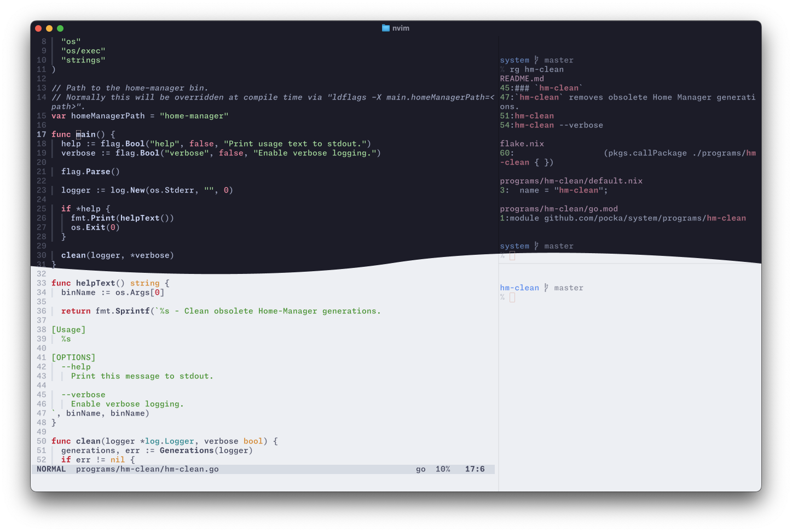

<!--
Copyright 2023 Shota FUJI <pockawoooh@gmail.com>

Licensed under the Apache License, Version 2.0 (the "License");
you may not use this file except in compliance with the License.
You may obtain a copy of the License at

    http://www.apache.org/licenses/LICENSE-2.0

Unless required by applicable law or agreed to in writing, software
distributed under the License is distributed on an "AS IS" BASIS,
WITHOUT WARRANTIES OR CONDITIONS OF ANY KIND, either express or implied.
See the License for the specific language governing permissions and
limitations under the License.

SPDX-License-Identifier: Apache-2.0
-->

# pocka/system

My systems configuration using Nix/Home Manager.



## Usage

See `outputs.homeConfigurations` section in [`flake.nix`](./flake.nix) for available `<name>`s.

### Local install

1. Clone or Download the repository
2. Run `nix-shell`
3. Inside the spawned shell, run `home-manager switch --flake .#<name>`
4. Exit the shell

Without interactive Bash session: `nix-shell --run "home-manager switch --flake .#<name>"`.

### Remote install

This is handy and useful especially for initial bootstrap, but less reproducible compared to local installation.

1. Make sure Flakes is available on your system
2. Run `nix run home-manager/master -- switch --flake github:pocka/system#<name>`

### Display changes between Home Manager generations

First, find the directory that contains Nix profiles.
For defaults location, see this page: <https://nix.dev/manual/nix/2.18/command-ref/files/profiles>.

Then, run `nix profile diff-closures --profile <profiles directory>/home-manager`.

## Requirements

### `dev-linux`

Due to each softwares' design limitation, the system needs to have these packages.

- [niri](https://github.com/YaLTeR/niri)
- [`pantheon-polkit-agent`](https://archlinux.org/packages/extra/x86_64/pantheon-polkit-agent/) ... The one installed installed using Nix cannot lookup `polkit-agent-helper-1`.
- [swaylock](https://github.com/swaywm/swaylock) ... access to PAM required, which is not possible with regular user Nix installation.

## Programs

### `hm-clean`

`hm-clean` removes obsolete Home Manager generations.

```sh
# Clean obsolete home-manager generations.
hm-clean

# with verbose logging.
hm-clean --verbose
```

## License

[Apache-2.0](./LICENSE)
